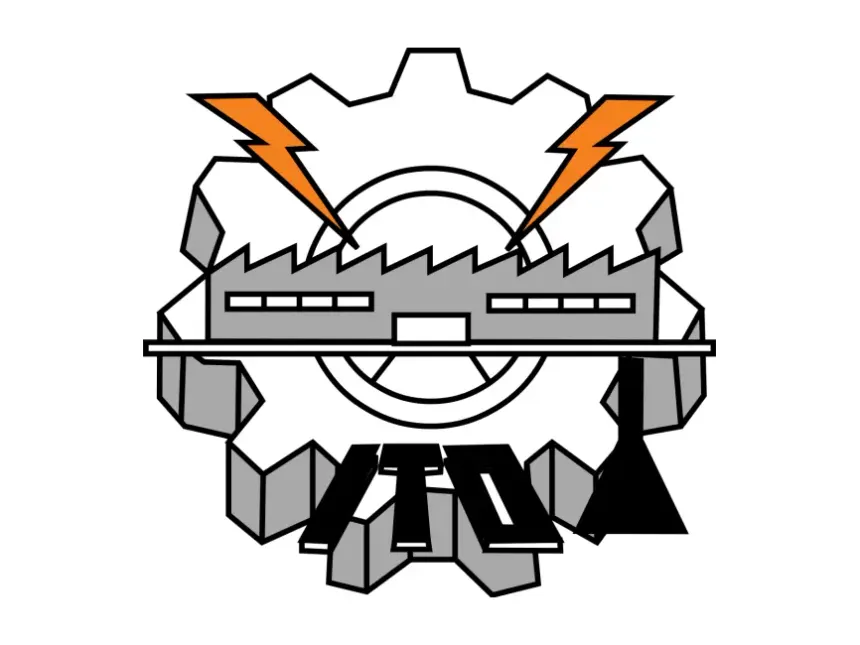
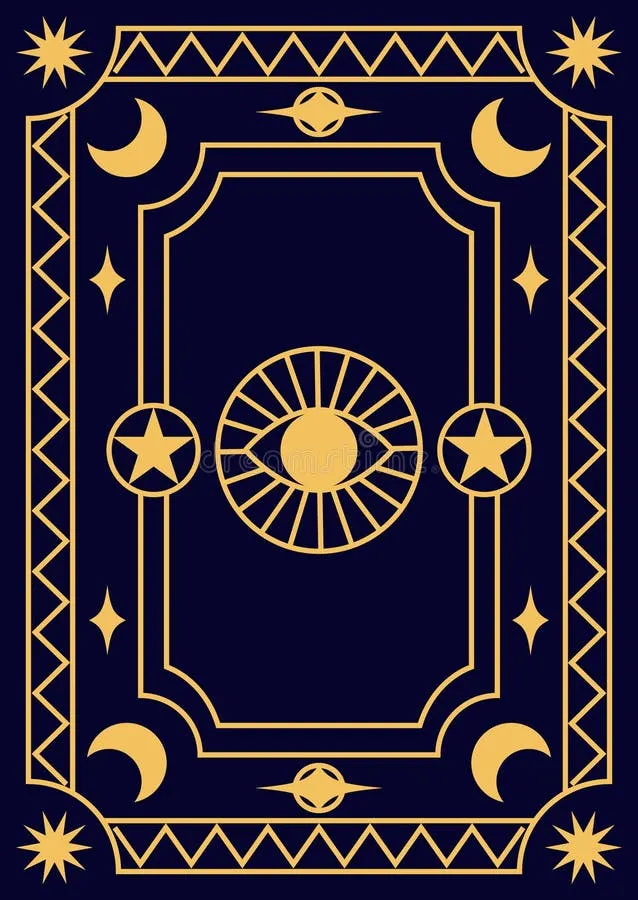

# Componente Visual Interactivo: 3D Flip Card Component (`card3d.js`)

## Problema que Resuelve

Resuelve el problema para un uso de presentacion de informacion (datos , logos , personajes , productos ... etc.) de forma 

---

## Instalación

Para integrar el componente en cualquier proyecto web, incluye las hojas de estilo y la librería JavaScript en tu documento HTML:

HTML:
<link rel="stylesheet" href="css/card3d.css">
<script src="js/card3d.js"></script>

---

## Uso y Ejemplos de Código

### 1. Estructura HTML

Inserta el contenedor con la clase `.card` y sus caras correspondientes (`.card-front` y `.card-back`). Incluye el contenedor `.glow` dentro de cada cara para habilitar la iluminación dinámica.

HTML:
<!DOCTYPE html>
<html lang="es">
<head>
    <meta charset="UTF-8">
    <meta name="viewport" content="width=device-width, initial-scale=1.0">
    <title>Demostración 3D Card</title>
    <link rel="stylesheet" href="css/card3d.css">
</head>
<body>

    <!-- COMPONENTE CARTA 3D INTERACTIVA -->
    <div class="card">
        <div class="card-inner">
            <!-- Cara Frontal -->
            <div class="card-front">
                <span>Frente</span>
                <div class="glow"></div>
            </div>
            <!-- Cara Trasera (Reverso) -->
            <div class="card-back">
                <span>Reverso</span>
                <div class="glow"></div>
            </div>
        </div>
    </div>

    <script src="js/card3d.js"></script>
    <script>
        // Inicialización del componente visual al cargar la página
        initInteractive3DCard('.card');
    </script>
</body>
</html>

---

### 2. Estilos CSS Básicos (`css/card3d.css`)

El componente utiliza la propiedad `preserve-3d` y `backface-visibility: hidden` para lograr la ilusión tridimensional y el giro correcto de imágenes.

CSS:
* {
    box-sizing: border-box;
    user-select: none;
}

body {
    display: flex;
    justify-content: center;
    align-items: center;
    min-height: 100vh;
    perspective: 1200px;
    background: #11111d;
}

.card {
    width: 300px;
    height: 400px;
    position: relative;
    cursor: grab;
}

.card-inner {
    width: 100%;
    height: 100%;
    position: relative;
    transform-style: preserve-3d;
    border-radius: 12px;
    box-shadow: 0 10px 30px rgba(0, 0, 0, 0.5);
}

.card-front, .card-back {
    position: absolute;
    width: 100%;
    height: 100%;
    top: 0;
    left: 0;
    padding: 1.5em;
    border-radius: 12px;
    backface-visibility: hidden;
    overflow: hidden;
}

/* Rutas relativas desde /css hacia la carpeta /img */
.card-front {
    background-image: url('../img/Itologo.webp');
    background-size: cover;
    background-position: center;
}

.card-back {
    background-image: url('../img/CardREverso.webp');
    background-size: cover;
    background-position: center;
    transform: rotateY(180deg);
}

.glow {
    position: absolute;
    width: 100%;
    height: 100%;
    top: 0;
    left: 0;
    pointer-events: none;
    border-radius: 12px;
}

---
### 3. Lógica JavaScript de la Librería (`js/card3d.js`)

Esta es la implementación del código fuente que ejecuta las interacciones en tiempo real:

```javascript
function initInteractive3DCard(selector = '.card') {
    const $cards = document.querySelectorAll(selector);

    $cards.forEach($card => {
        const $inner = $card.querySelector('.card-inner');
        const $glows = $card.querySelectorAll('.glow');

        let bounds;
        let isRightClicking = false;
        let startX = 0;
        let currentRotationY = 0;
        let dragRotationY = 0;

        $card.addEventListener('contextmenu', (e) => e.preventDefault());

        function rotateToMouse(e) {
            if (!bounds) return;

            const mouseX = e.clientX;
            const mouseY = e.clientY;
            const leftX = mouseX - bounds.x;
            const topY = mouseY - bounds.y;
            const center = {
                x: leftX - bounds.width / 2,
                y: topY - bounds.height / 2
            };

            const tiltX = center.y / 15;
            const tiltY = -center.x / 15;
            const totalY = currentRotationY + dragRotationY + tiltY;

            $inner.style.transform = `
                scale3d(1.05, 1.05, 1.05)
                rotateX(${tiltX}deg)
                rotateY(${totalY}deg)
            `;

            $glows.forEach($glow => {
                $glow.style.backgroundImage = `
                    radial-gradient(
                        circle at
                        ${center.x * 2 + bounds.width / 2}px${center.y * 2 + bounds.height / 2}px,
                        rgba(255, 255, 255, 0.35),
                        rgba(0, 0, 0, 0.1)
                    )
                `;
            });
        }

        $card.addEventListener('mousedown', (e) => {
            if (e.button === 2) {
                isRightClicking = true;
                startX = e.clientX;
                $card.style.cursor = 'grabbing';
            }
        });

        document.addEventListener('mousemove', (e) => {
            if (isRightClicking) {
                const deltaX = e.clientX - startX;
                dragRotationY = deltaX * 0.8;
            }
            if (bounds) {
                rotateToMouse(e);
            }
        });

        document.addEventListener('mouseup', (e) => {
            if (e.button === 2 && isRightClicking) {
                isRightClicking = false;
                $card.style.cursor = 'grab';

                if (Math.abs(dragRotationY) > 60) {
                    currentRotationY = (currentRotationY === 0) ? 180 : 0;
                }
                dragRotationY = 0;

                $inner.style.transition = 'transform 0.4s ease';
                $inner.style.transform = `rotateY(${currentRotationY}deg)`;

                setTimeout(() => {
                    $inner.style.transition = '';
                }, 400);
            }
        });

        $card.addEventListener('mouseenter', () => {
            bounds = $card.getBoundingClientRect();
        });

        $card.addEventListener('mouseleave', () => {
            bounds = null;
            if (!isRightClicking) {
                $inner.style.transition = 'transform 0.5s ease';
                $inner.style.transform = `rotateY(${currentRotationY}deg)`;
                $glows.forEach($glow => $glow.style.backgroundImage = '');
                
                setTimeout(() => {
                    $inner.style.transition = '';
                }, 500);
            }
        });
    });
}
```

---

### 4. Documentación del Código JS (JSDoc)

A continuación se detalla la especificación de funciones, tipos de datos y manejo de eventos internos del componente:

* **Función Principal:** `initInteractive3DCard(selector)`
  * **`selector`** *(string)*: Selector CSS de la tarjeta (Por defecto: `'.card'`).
* **Variables de Estado Internas:**
  * **`bounds`** *(DOMRect)*: Almacena las dimensiones y coordenadas físicas de la tarjeta en el Viewport (`getBoundingClientRect()`).
  * **`isRightClicking`** *(boolean)*: Bandera que valida si el usuario mantiene presionado el botón secundario del mouse.
  * **`startX`** *(number)*: Punto $X$ de origen al iniciar el arrastre con clic derecho.
  * **`currentRotationY`** *(number)*: Ángulo $Y$ estático ($0^\circ$ o $180^\circ$) que define qué cara de la tarjeta está visible.
  * **`dragRotationY`** *(number)*: Ángulo $Y$ dinámico generado mientras se arrastra el mouse horizontalmente.
* **Manejo de Eventos y Algoritmo Interno:**
  1. **`contextmenu`**: Cancela el menú desplegable predeterminado del navegador mediante `e.preventDefault()`.
  2. **`rotateToMouse(e)`**: Modula las propiedades `rotateX`, `rotateY` y `scale3d` dividiendo la distancia del cursor respecto al centro de la carta para crear la inclinación física (*Tilt*).
  3. **`mousedown` (Botón 2)**: Detecta el clic derecho, fija la coordenada $X$ inicial y cambia el cursor visual a `grabbing`.
  4. **`mousemove`**: Calcula `deltaX` para actualizar el giro de la carta en tiempo real si el clic derecho sigue activo.
  5. **`mouseup`**: Si el arrastre supera los $60^\circ$ de umbral, alterna la tarjeta entre $0^\circ$ y $180^\circ$ aplicando una transición fluida en CSS.


  ## Capturas de Pantalla y Demostración Visual

El componente interactivo cuenta con dos estados visuales principales según la cara expuesta mediante el giro de $180^\circ$:

| Cara Frontal (`.card-front`) | Cara Trasera / Reverso (`.card-back`) |
| :---: | :---: |
|  |  |

### Explicación de los Componentes Visuales

1. **Cara Frontal (`Itologo.webp`):**
   * Muestra el logotipo institucional del **Instituto Tecnológico de Oaxaca (ITO)**.
   * Cuenta con la capa interactiva `.glow` integrada que proyecta un reflejo dinámico tipo lente brillante que sigue las coordenadas exactas del puntero sobre la insignia.

2. **Cara Trasera (`CardREverso.webp`):**
   * Muestra un diseño generico 
   * Aplica la propiedad `transform: rotateY(180deg)` y `backface-visibility: hidden` para mantenerse oculta hasta que el usuario realiza la acción de arrastre con el clic derecho y al igual que la frontal ... cuenta con detalles de iluminacion dinamica .


 **Link del video demostrativo**
 
   https://drive.google.com/file/d/1qd2UXAvJTqEofE4lzy8RLpS7s7folYme/view?usp=drive_link